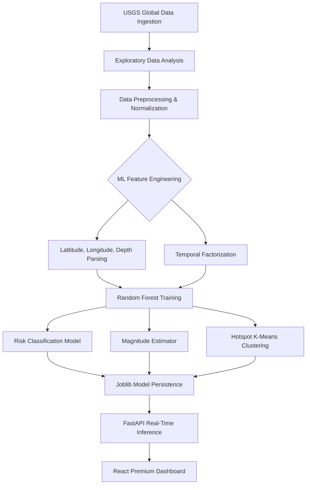

# 🛰️ QuakeRisk AI: Global & Regional Seismic Hazard Intelligence

QuakeRisk AI is a sophisticated full-stack earthquake monitoring and risk analysis platform. Built with a focus on the Indian subcontinent, it leverages **Machine Learning (Random Forest)** and real-time **USGS Geospatial data** to provide high-precision seismic intelligence.

---

## 🚀 Key Features

### 🌍 1. Advanced Geospatial Monitoring
- **Interactive Global Map**: Precise coordinate selection using Leaflet & OpenStreetMap.
- **Smart Address Search**: Instant geocoding that pans the map to any specific city or street worldwide.
- **High-Fidelity Tracking**: Real-time display of focus coordinates and monitoring status.

### 🛡️ 2. Predictive Risk Engine (ML)
- **Random Forest Risk Classifier**: Predicts "Low", "Medium", or "High" risk levels based on depth and coordinates.
- **Magnitude Estimation**: Quantitative prediction of potential earthquake magnitude (Mw) using pre-trained regression models.
- **Hotspot Analysis**: Backend-side clustering to identify regional seismic patterns.

### 🇮🇳 3. Real-Time India-Region Logs
- **Live Streamed Data**: Direct integration with the **USGS FDSN Event Web Service**.
- **Regional Filtering**: Exclusively tracks seismic activity within the Indian subcontinent (8°N-38°N, 68°E-98°E).
- **Auto-Polling**: The dashboard updates every **30 seconds** without requiring a page refresh.

### 📄 4. Professional Reporting & Data Export
- **Dynamic PDF Reports**: Generate professional seismic assessments (with disclaimers) on-the-fly for any coordinate.
- **CSV Data Export**: One-click download of the latest 30-day India dataset for secondary analysis in Excel or GIS.
- **Session Persistence**: Automated `localStorage` caching ensures your assessment history is never lost.

---

## 🌳 Machine Learning Pipeline

The system uses a multi-stage pipeline for geospatial risk classification and magnitude estimation.



## 🏗️ Technical Architecture

| Component | Technology | Role |
| :--- | :--- | :--- |
| **Frontend** | React + Vite | Modern, high-performance UI Dashboard. |
| **Backend** | FastAPI (Python) | High-speed inference and data processing. |
| **ML Models** | Scikit-Learn | Random Forest & K-Means for risk/hotspots. |
| **Mapping** | Leaflet.js | OpenStreetMap-based tiling (no API key required for map loads). |
| **Reporting** | FPDF | Server-side PDF generation engine. |

---

## 📂 Project Structure

```text
QuakeRisk/
├── backend/
│   ├── main.py              # Core FastAPI Application & Inference
│   ├── models/              # Pre-trained .pkl Model files
│   └── requirements.txt     # Python Dependencies
├── frontend/
│   ├── src/                 
│   │   ├── App.jsx          # Dashboard Logic & State Management
│   │   └── index.css        # Premium Design & Layout Tokens
│   └── package.json         # React & UI Dependencies
├── notebook/
│   ├── ML_Pipeline.md       # Technical Process Documentation
│   ├── download_data.py     # USGS Raw Data Fetcher
│   └── train_models.py      # ML Training Pipeline
└── DEPLOYMENT.md            # Step-by-Step Hosting Guide
```

---

## 🛠️ Getting Started Locally

### 1. Backend Setup
```bash
cd backend
pip install -r requirements.txt
uvicorn main:app --reload
```

### 2. Frontend Setup
```bash
cd frontend
npm install
npm run dev
```

---

## 🛡️ Seismic Methodology & Data
Models are trained using historical USGS datasets (2018-2023) ensuring robust predictions based on tectonic shift history.

**Disclaimer**: *This project is for research and informational purposes. Predictions are based on historical probability and should not be used as the sole source for emergency planning.*

---
**Maintained by**: Vikash9546
**Repository**: [QuakeRiskAI](https://github.com/Vikash9546/QuakeRiskAI)
