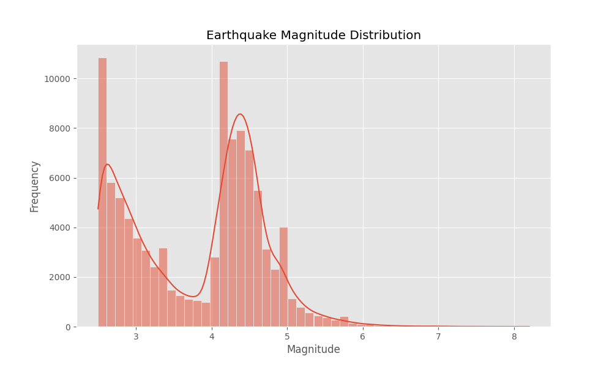
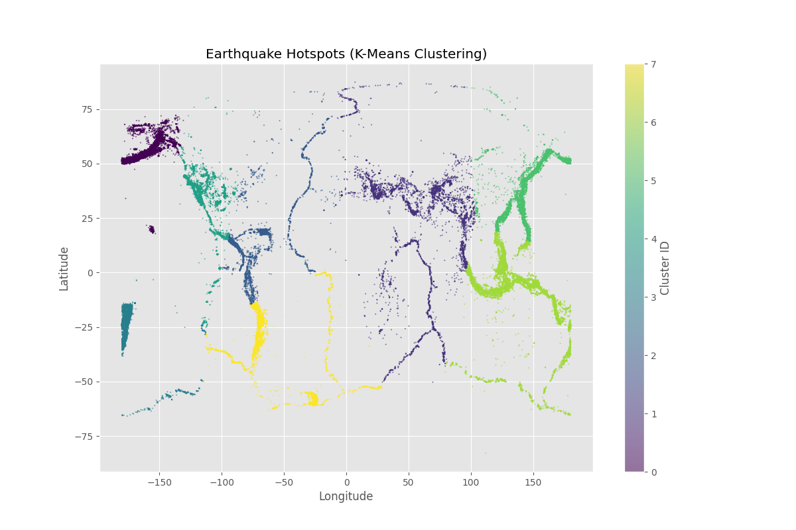

# Earthquake Risk Analysis System - ML Models

This notebook outlines the process of training the machine learning models used in the system.

## 1. Data Loading and Exploration

We use the USGS earthquake dataset (2020-2024).

```python
import pandas as pd
import numpy as np
import matplotlib.pyplot as plt
import seaborn as sns

df = pd.read_csv('earthquake_data.csv')
print(df.info())
print(df.head())
```

### Magnitude Distribution
Most earthquakes in the dataset are small, with a few reaching significant magnitudes (5+).



## 2. Preprocessing & Feature Engineering

We convert time strings to datetime objects and extract relevant features like days, months, and rolling counts of earthquakes.

```python
features = ['latitude', 'longitude', 'depth', 'freq_30', 'time_diff']
```

## 3. Risk Classification (Model 1)

Goal: Predict if an earthquake will be >= 5.0 magnitude.
Algorithm: Random Forest Classifier.

- **Accuracy**: 0.9385
- **Precision**: 0.4860
- **Recall**: 0.0424
- **F1 Score**: 0.0780

## 4. Magnitude Prediction (Model 2)

Goal: Predict the expected magnitude of a seismic event.
Algorithm: Random Forest Regressor.

- **RMSE**: 0.4114
- **MAE**: 0.2961

## 5. Hotspot Detection (Model 3)

We use K-Means clustering to identify high-risk zones globally.



## 6. Model Persistence

All models are saved using `joblib` for deployment in the FastAPI backend.
